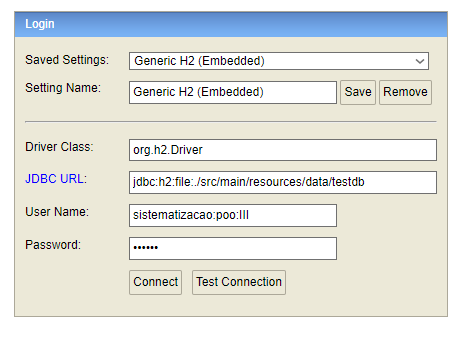

# Projeto CRUD com Banco de Dados H2

Este projeto é uma aplicação que simula um sistema de adoção de animais e utiliza Java como linguagem, que utiliza o banco de dados H2 em memória para persistência de dados. O ponto de entrada da aplicação é o arquivo `Application`.

## Tecnologias Utilizadas

- **Java**: Linguagem principal.
- **H2 Database**: Banco de dados em memória para desenvolvimento e testes.
- **Spring Boot**: Framework para facilitar o setup e a execução da aplicação.
- **JPA/Hibernate**: Para o mapeamento objeto-relacional.


# Instruções para Executar a Aplicação

## Executando a Aplicação

1. Clone o repositório e navegue até o diretório do projeto.

2. Compile o projeto utilizando Maven:

   ```bash
   mvn clean install

3. Inicie a aplicação executando a classe Application.

+ Se estiver utilizando uma IDE, basta clicar com o botão direito em `Application` e selecionar "Run".

+ Via terminal, execute:

   ```bash
   mvn spring-boot:run

# Acessando o Console H2

Com o console H2 ativado (spring.h2.console.enabled=true), você pode acessar a interface web para visualizar o banco de dados em 

  
    http://localhost:8080/h2-console.

### Dados para Login no Console H2

**Driver Class:**```org.h2.Driver```

**JDBC URL:**```jdbc:h2:file:./src/main/resources/data/testdb```

**User Name:** ```sistematizacao:poo:III```

**Password:** ```123456```

### Exemplo


### Dados

O banco de dados já inicia com um dado específico e com o banco inicializado, exatamente como está exemplificado na imagem abaixo.


# Testes

## Executando Testes

Os testes podem ser executados utilizando Rest-Assured e inicializados no arquivo `ApplicationTests`.

Ou no terminal, para rodar os testes, utilize:

```bash
mvn test
```

## Observação

Ao rodar os testes certifique-se que o servidor não está conectado ou ativo, pois isso irá gerar um erro e fará com que falhem.